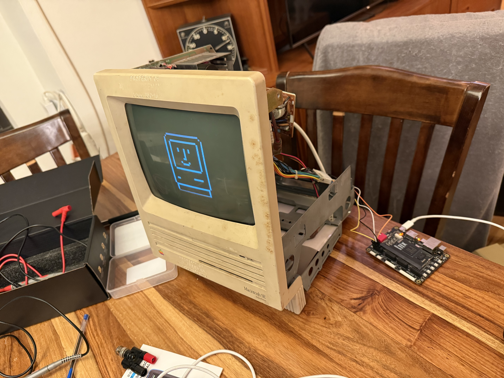
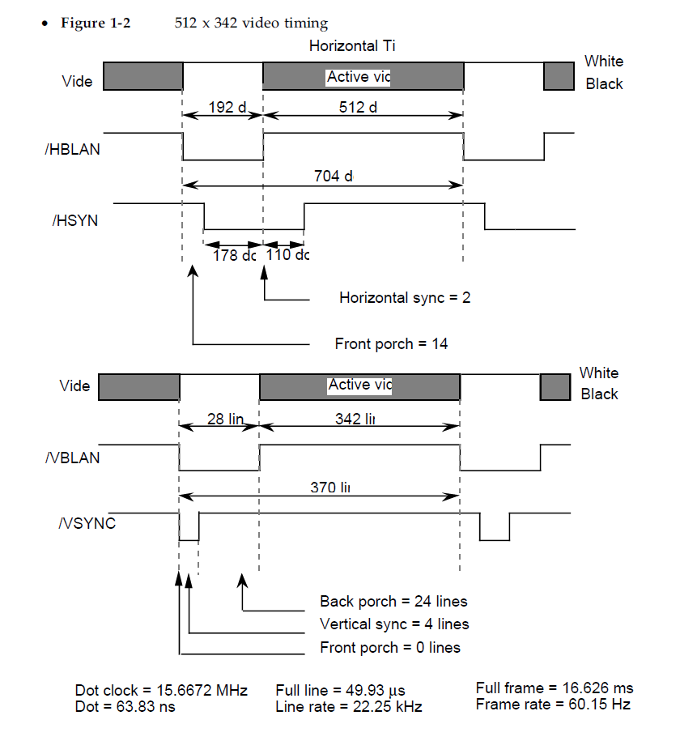

# Mac SE Modern Input Custom Video Card

## update 2025 05 26 Displaying cute Mac icon from framebuffer! The uncharted world of outputting Mac SE video is behind us!

## Project Overview

This project aims to create a custom video card for classic Macintosh SE, allowing modern HDMI video input to be displayed on the original monochrome Mac CRT monitor. Finally, I'll be able to watch youtubes on a low resolution monochrome curved monitor. 

## Features

- Preservation of original Mac SE monitor, case, powersupply for maximum retro-nerd
- Modern HDMI video input compatibility (800x600 60hz)
- Nearest-neighbor scaling from 800x600 to 512x342 resolution
- Monochrome conversion with simple RGB thresholding
- Frame buffer for cross time-domain output synchronization
- test pattern showing Susan Kare's smiling Mac icon!

## Hardware Components

- Macintosh SE (bad logic board)
- HDMI Decoder: TFP401
- FPGA: Tang Nano 20k (Gowin GW2A-18) on Project Dock board for nice pins and RGB connector
- connector for J12 (power for circuit and VIDEO, HSYNC, VSYNC input)
- panel mount HDMI connector
- FPGA 3.3v should be fine as inputs on analogue board are buffered through 74LS38 Quad 2-input NAND (update, yes, 3.5v works fine!)

## Timing Diagram

### Display Characteristics
- Original Resolution: 512 × 342 pixels
- Monochrome display

### Key Modules
1. **Input Coordinate Generator**: Generates pixel coordinates from HDMI input signals (HSync, VSync, Data Enable). TODO
2. **Color Converter**: Converts 24-bit RGB input to 1-bit monochrome using a simple thresholding method. TODO
3. **Scaler**: Performs nearest-neighbor scaling from 800x600 to 512x342 resolution. TODO
4. **Frame Buffer**: Stores scaled monochrome pixel data for synchronization with Mac SE timing.  DONE. It's 175104x1 to avoid having to do multiplication, but might need to change to match Mac's 512x342 to make writing easier.
5. **Mac SE Timing Generator**: Generates horizontal and vertical sync signals, active display region, and pixel coordinates for the Mac SE monitor. DONE mac_se_timing_generator.v does all the heavy lifting.

Diagram here:
https://miro.com/app/board/uXjVI_tZUDw=/

## I/O Wiring

mac_vsync = R8
mac_hsync = T7
video_out = P8 
mac_pixel_clk = T6 (diagnostic)
mac_active = P6 (diagnostic)
Clock (input) = unused

- GPIO wiring 
    Active      P6  T6  mac_pixel_clock
    HSYNC       T7  R8  VSYNC
    VIDEO       P8  T8
                T9  P9
                gnd gnd
                3v3 3v3

- Mac J-12 Connector from Analog board to Digital board
    gnd         1   8   gnd
    gnd         2   9   video
    gnd         3   10  HSYNC
    gnd         4   11  VSYNC
    gnd         5   12  +5v
    nc          6   13  +5v
    nc          7   14  +12v (probably will use this to power project)

## Development Stages

- Got the Arduino setting the PLL working.
    Spent hours struggling because Claude couldn't set it right. 
    Found example code and just had Claude write the timing data, which worked.
- Got a first untested draft of the Verilog for the FPGA -- untested but compiled. ✅
    Spent an hour trying to mount the FPGA as a drive to drop the compiled .JED to it.
    Turns out I need a dumb USB-A to USB-C cable and that works. Actual USB-C doesn't.
-  Gave up on using external PLL since I got the Gowin internal clock working, no need for external PLL or Arduino to configure it
- Vibe coded huge hunks of Verilog based on ancient technical specifications.
- Implemented key Verilog modules:
    - **Mac SE Timing Generator**: Updated with Classic II specs.
    - **Scaler**: Nearest-neighbor scaling logic. UNTESTED
    - **Color Converter**: Simple RGB-to-monochrome thresholding. UNTESTED
    - **Frame Buffer**: Added BRAM instantiation for synchronization. UNTESTED
- Fiddled with the Mac_se_timing generator until it looked good on the oscilloscope
- I think I had trouble diagnosing clock timings because my cheapo-scope maxes out at 20MHz
- Plugged it into the Mac on 2025 04 26 AND IT WORKED OUT OF THE BOX
- video was a little to the right because the clock was a little slow
- fiddled with the front porch and other timings and got it looking good
- Got the BSRAM initialized with the Mac Icon and hooked showing it (vibe coded a BMP -> initialization file formatter in python, bram_initializer.py)

## TODO

- TODO: Read in the HDMI data NOT STARTED TESTING VIBE CODE
- TODO: Test the scaler NOT STARTED TESTING VIBE CODE
- TODO: test the color_converter   NOT STARTED TESTING VIBE CODE
- TODO: write the pixels into Port A of the framebuffer

### Software/Tools
- Gowin FPGA Development Environment
- Oscilloscope
- Gemini 2.5 Pro (Experimental) (for vibe coding)
- Github Co-pilot
- VSCode
- Gowin FPGA designer

## Potential Challenges

- Precise timing synchronization
- Signal integrity maintenance
- Power management
- Resolution scaling
- Wrong timing might fry tube
- high voltage coil + capacitor might fry developer

## Disclaimer

This is an experimental project. Proceed with caution when modifying vintage hardware. And remember kids, electricity kills. Be very, very careful around the CRT.

## Contact
