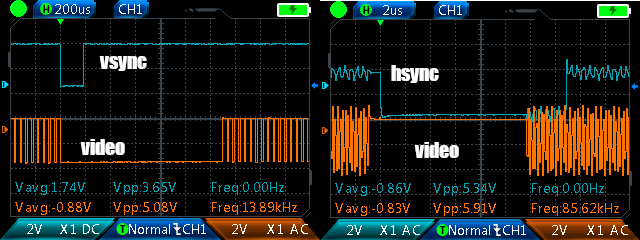
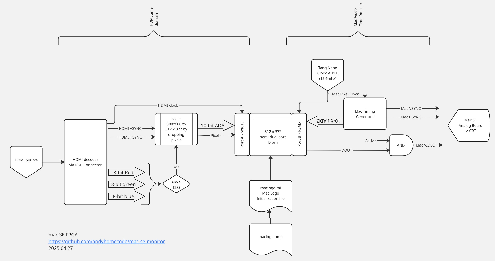

# Mac SE Modern Input Custom Video Card

## update 2025 05 4 

It works! HDMI image is shown on the mac monitor!

Problems are it doesn't scale right to the full height/depth of the screen.  Black bar above and below. Need to implement a gray scale dithering--hard black & white isn't usable.

PROBLEM: Pin R9 on the FPGA is used by the TTL RGB cable connector for rgb_odck (dot clock) and onboard is FASTRD_N, which is used to communicate with the External Flash memory used to "boot" the FPGA.  The HDMI device is sending the dotclck down and messes up reads on boot, so the FPGA won't configure itself.  

TODO: Use the breakout boards to move the dot clock to someplace else harmless, like one of the lesser color bits, and map it in the FPGA.

pin 30 (or Pin 11 upside down) is the problem.


Maaaybe I can toggle dual-use on?  That might do something?

## Project Overview

This project aims to create a custom video card for classic Macintosh SE, allowing modern HDMI video input to be displayed on the original monochrome Mac CRT monitor. Finally, I'll be able to watch youtubes on a low resolution monochrome curved monitor. 


## Features

- Preservation of original Mac SE monitor, case, powersupply for maximum retro-nerd
- Modern HDMI video input compatibility (800x600 60hz)
- Nearest-neighbor scaling from 800x600 to 512x342 resolution
- Monochrome conversion with simple RGB thresholding
- Frame buffer for cross time-domain output synchronization
- test pattern showing Susan Kare's smiling Mac icon!

## Hardware Components

- [Macintosh SE SuperDrive](https://en.wikipedia.org/wiki/Macintosh_SE) (bad logic board and beat up like [Gonk on tattoine](https://www.starwars.com/databank/gonk-droid))
- HDMI Decoder: [TFP401 from Adafruit](https://www.adafruit.com/product/2219)
- FPGA: [Tang Nano 20k (Gowin GW2A-18)](https://wiki.sipeed.com/hardware/en/tang/tang-primer-20k/primer-20k.html) on Project Dock board for nice pins and RGB connector
- connector for J12 (power for circuit and VIDEO, HSYNC, VSYNC input)
- panel mount HDMI connector
- Note: FPGA 3.3v should be fine as inputs on analogue board which are 5v TTL, but they are buffered through 74LS38 Quad 2-input NAND (update, yes, 3.5v works fine!)

## Timing Diagram




### Display Characteristics
- Original Resolution: 512 × 342 pixels
- Monochrome display

### Key Modules
1. **main.v**: this does all the heavy lifting.
2. **Frame Buffer**: Stores scaled monochrome pixel data for synchronization with Mac SE timing.  DONE. It's 175104x1 to avoid having to do multiplication, but might need to change to match Mac's 512x342 to make writing easier.  GOWIN IP generated
3. **Mac SE Timing Generator**: Generates horizontal and vertical sync signals, active display region, and pixel coordinates for the Mac SE monitor. DONE mac_se_timing_generator.v does all the heavy lifting.
4. **Clock**: makes the right frequency for the Mac.  GOWIN IP generated



Diagram here:
https://miro.com/app/board/uXjVI_tZUDw=/

## I/O Wiring

```plaintext
- GPIO wiring
    Active      P6  T6  mac_pixel_clock
    HSYNC       T7  R8  VSYNC
    VIDEO       P8  T8
                T9  P9
                gnd gnd
                3v3 3v3


- Mac J-12 Connector from Analog board to Digital board
    gnd         1   8   gnd
    gnd         2   9   video
    gnd         3   10  HSYNC
    gnd         4   11  VSYNC
    gnd         5   12  +5v
    nc          6   13  +5v
    nc          7   14  +12v (probably will use this to power project)

- TFP401
Note, the TFP-40p cable only works when upside down
(electrical connections on top, not bottom), 
so all connections are x = x - 41 (40=1, 39=2, etc.)

    12 (29) = gnd
    11 (30) = Pixel Clock
    10 (31) = Active (high when getting HDMI, low when unplugged)
    9 (32) = HSYNC
    8 (33) = VSYNC
    7 (34) = DISPLAY ENABLE

Full cable specs:
https://hackaday.com/2024/01/25/displays-we-love-hacking-parallel-rgb/ 

Regular Upside Down	Description
1	    40	         1  VLED- LED Cathode
2	    39	         2  VLED+ LED Anode
3	    38	         3  GND Ground
4	    37	         4  VDD Power Supply (this seems to power the TFP401 board)
5	    36	         R0  LSB
6	    35	         R1
7	    34	         R2
8	    33	         R3
9	    32	         R4
10	    31	         R5
11	    30	         R6
12	    29	         R7  MSB
13	    28	         G0
14	    27	         G1
15	    26	         G2
16	    25	         G3
17	    24	         G4
18	    23	         G5
19	    22	         G6
20	    21	         G7
21	    20	         B0
22	    19	         B1
23	    18	         B2
24	    17	         B3
25	    16	         B4
26	    15	         B5
27	    14	         B6
28	    13	         B7
29	    12	         Gnd
30	    11	         Pixel Clock
31	    10	         Active (high when HDMI plugged in to computer)
32	    9	         HSYNC
33	    8	         VSYNC
34	    7	         DISPEN
35	    6	         35 NC NC
36	    5	         36 GND Ground
37	    4	         37 XR/INT Resistive touch panel  
38	    3	         38 YD/RST Resistive touch panel 
39	    2	         39 XL/SCL Resistive touch panel 
40	    1	         40 YU/SDA Resistive touch panel 

But, if I plug the flat cable into the FPGA upside-down (conductive side up)
also, everything is back where it should be.

The breakout boards have to be conductive side down (flipping the 1 for 40)

Also, if the TTL RGB cable is connected, you cannot program to Flash,
only SRAM (which is lost on power cycle).  Unhook to program.  And yes, 
it took me a long, long time to figure this out. 

```
## Where is the meat of the code?

- [Gowin/macse-tang-20k/src/](Gowin/macse-tang-20k/src/)
- [Gowin/macse-tang-20k/src/main.v](Gowin/macse-tang-20k/src/main.v) does the heavy lifting

## Development Stages

- Got the Arduino setting the PLL working.
    Spent hours struggling because Claude couldn't set it right. 
    Found example code and just had Claude write the timing data, which worked.
- Got a first untested draft of the Verilog for the FPGA -- untested but compiled. ✅
    Spent an hour trying to mount the FPGA as a drive to drop the compiled .JED to it.
    Turns out I need a dumb USB-A to USB-C cable and that works. Actual USB-C doesn't.
-  Gave up on using external PLL since I got the Gowin internal clock working, no need for external PLL or Arduino to configure it
- Vibe coded huge hunks of Verilog based on ancient technical specifications.
- Implemented key Verilog modules:
    - **Mac SE Timing Generator**: Updated with Classic II specs.
    - **Scaler**: Nearest-neighbor scaling logic. UNTESTED
    - **Color Converter**: Simple RGB-to-monochrome thresholding. UNTESTED
    - **Frame Buffer**: Added BRAM instantiation for synchronization. UNTESTED
- Fiddled with the Mac_se_timing generator until it looked good on the oscilloscope
- I think I had trouble diagnosing clock timings because my cheapo-scope maxes out at 20MHz
- Plugged it into the Mac on 2025 04 26 AND IT WORKED OUT OF THE BOX
- video was a little to the right because the clock was a little slow
- fiddled with the front porch and other timings and got it looking good
- Got the BSRAM initialized with the Mac Icon and hooked showing it (vibe coded a BMP -> initialization file formatter in python, bram_initializer.py)
- 2025 05 03 Figured out why I couldn't read any data from the TFP401--the flat ribbon cable only makes electrical connection when upside down.  Pin 40 is now 1. 
- 2025 05 03 IT IS ALIVE!!! Had to use Gemini Deep Research to figure out the proper timings for TTL RGB and was able to get scaled addresses to write into the buffer!!!  Now the problem is that the whole image is shifted 1/2 the screen to the right and wrapped around, has a top front porch that's pretty big and the bottom of the image is off the screen, and there's jitter in the bottom half of the image.  BUT IT IS ALIVE!!!
- 2025 05 04 IT WORKS!!!  By adding a buffer between reading the incoming HDMI->TTL RGB stream and the framebuffer, it seems to have fixed some timing problems. DE HSYNC VSYNC and DATA were all exactly right on the incoming lines, now that I'm grabbing it all at once, it's writing the right data to the framebuffer.  No jitter. No shifting from a delay 

## TODO

- TODO: Figure out why it's shifted down from the top. Reading lines too early?
- TODO: Tone down the brightness cutoff so it's not totally washed out.
further down
- TODO: 3D print a holder board to mount the board inside the Mac
- TODO: Wire up 5-v power to the HDMI board or 12v to the FPGA (probably FPGA) to the Mac power supply
- TODO: put HDMI connector through back or front of Mac using extension.
- TODO: add a ROM of the Mac logo (maybe with QR?) and show that when ACTIVE low (no HDMI)


### Software/Tools
- Gowin FPGA Development Environment
- Oscilloscope
- Gemini 2.5 Pro (Experimental) (for vibe coding)
- Github Co-pilot
- VSCode
- Gowin FPGA designer

## Potential Challenges

- Precise timing synchronization
- Signal integrity maintenance
- Power management
- Resolution scaling
- Wrong timing might fry tube
- high voltage coil + capacitor might fry developer


## Disclaimer

This is an experimental project. Proceed with caution when modifying vintage hardware. And remember kids, electricity kills. Be very, very careful around the CRT.

## Contact
